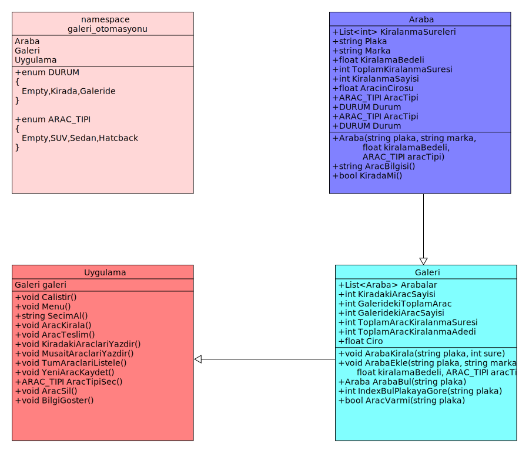

# Galeri Otomasyonu
## Nedir
> Galeri Otomasyonu Konsol uygulaması ile araç kiralama işlemi yapabiliyoruz. Aynı zamanda her kiralama işlemini list yapısı ile saklıyoruz böylece detaylı verilere sahip oluyoruz.

## Özellikleri
1. Araba Kirala
2. Araba Teslim Al
3. Kiradaki arabaları listele
4. Müsait arabaları listele
5. Tüm arabaları listele
6. Yeni araba Ekle
7. Araba sil
8. Bilgileri göster

## UML Class diagramı

## Ekip Üyeleri
> * Ömer Genç
> * Dilan Candan Sarı
> * Kübra Kaysal
> * Rızacan Öztürk
> * Kasım Güneş

## Start

Temel iskelet yapısı oluşturuldu

## V 0.1

Yeni metotlar eklendi, program çalışıyor

## Final

Son dokunuşlar yapıldı